# ODS -- Operational Data Store.

Replicate Dataverse data to Azure SQL Database. ADF Based D365 Data Export Services, which can be the replacement for the retired D365 DES Service.

## Contributors

- Chetan Hiran
- Sathishkumar Ramamurthy
- Amrita Ahirrao
- Dakota Giltner

## Version

1.0.0

## Table of Contents

- [Overview](#overview)
- [Prerequisites](#prerequisites)
- [Architecture](#architecture)
  - [Best Practices when using ODS framework.](#best-practices-when-using-ods-framework)
- [Deployment Steps](#deployment-steps)
  - [Create Data Factory](#create-data-factory)
  - [Import the Pipelines through ARM Template](#import-the-pipelines-through-arm-template)
  - [Post deployment validation](#post-deployment-validation)
- [Pipeline Details and Execution Sequence:](#pipeline-details-and-execution-sequence)
  - [01 - Master Data Load](#01---master-data-load)
    - [How to Execute the Pipeline](#how-to-execute-the-pipeline)
  - [02 - Entity Schema Sync Master](#02---entity-schema-sync-master)
  - [03 - Data Sync Master:](#03---data-sync-master)
- [Known Issues](#known-issues)

## Overview


ODS is a framework developed to replicate data from Microsoft Dataverse
to an Azure SQL Database in a user owned Azure Subscription. This
framework will replicate data similar to [Data Export
Services](https://learn.microsoft.com/en-us/power-platform/admin/replicate-data-microsoft-azure-sql-database).
Since [Data Export
Services](https://learn.microsoft.com/en-us/power-platform/admin/replicate-data-microsoft-azure-sql-database)
got retired and got replaced with [Azure Synapse Link for
Dataverse](https://learn.microsoft.com/en-us/power-apps/maker/data-platform/export-to-data-lake).
Currently there is no support to export the Dataverse data directly to
Azure SQL Server close to real time, as Azure Synapse link has the
latency of \~15 mins or more. This ODS framework will solve this problem
in a cost-effective way and eliminates the dependency on Synapse.

ODS supports Azure SQL Database, but the framework can be easily
extended to support SQL Server on Azure virtual machines or on-Premises
SQL server. The ODS intelligently synchronizes the full Dataverse data
initially and thereafter synchronizes on a continuous basis as changes
occur (delta changes) in the system.

### How does ODS sync the Data from Dataverse

ODS uses the change tracking flag in Dataverse to synchronize data with
external systems, refer to the link [Use change tracking to synchronize
data with external systems (Microsoft Dataverse) - Power Apps \|
Microsoft
Learn](https://learn.microsoft.com/en-us/power-apps/developer/data-platform/use-change-tracking-synchronize-data-external-systems)
to learn about the change tracking and delta token.

## Prerequisites

1.  Azure SQL database:

A Azure SQL database and an account with the below permissions.

| Permission Type | Permission Name  |
| --------------- | ---------------- |
| CRTB            | CREATE TABLE     |
| CRTY            | CREATE TYPE      |
| CRVW            | CREATE VIEW      |
| CRPR            | CREATE PROCEDURE |

Schema permissions required:

---

| Permission type code | Permission name |
| -------------------- | --------------- |
| AL                   | ALTER           |
| IN                   | INSERT          |
| DL                   | DELETE          |
| SL                   | SELECT          |
| UP                   | UPDATE          |
| EX                   | EXECUTE         |
| RF                   | REFERENCES      |

2.  **Azure Data Factory:**

Follow [these steps](https://learn.microsoft.com/en-us/azure/data-factory/quickstart-create-data-factory) to create the data factory.

3.  **Azure Key Vault service**

Create an Azure Key Vault and provide Secrets User Role for Data
Factory.

4.  **Azure Blob Storage**

Create Azure Blob Storage and provide Data Contributor role for Data
factory. The ADF pipeline execution logs can be found in this storage.

5.  Microsoft Dataverse

    In D365 provision an Application user with System Administrator
    security role and we will use this Application user context to call
    the OData API in Pipelines.

## Architecture

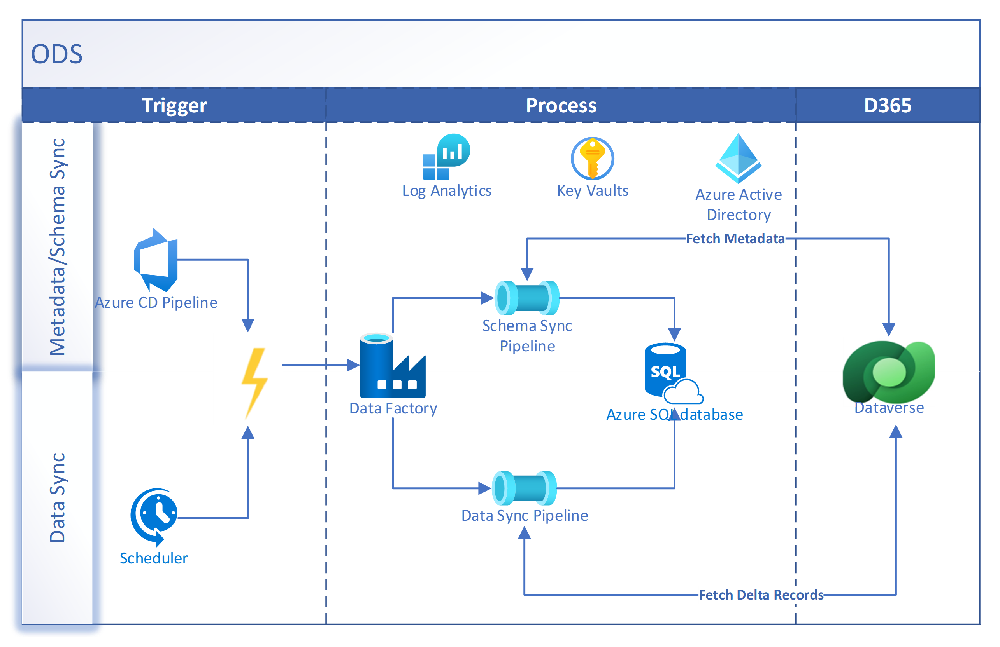

6.  Pipeline Design:

    a. Schema Sync Pipeline

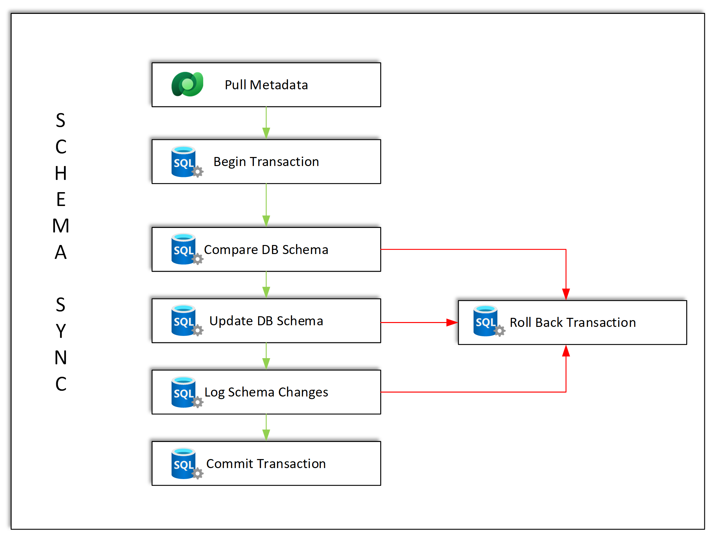

b. Data Sync Pipeline

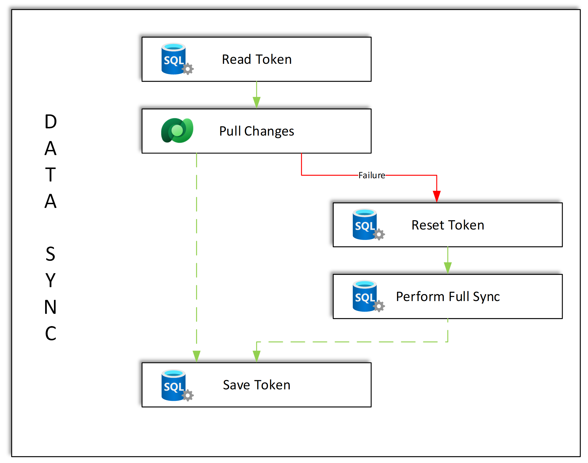

### Best Practices when using ODS framework.

- To avoid synchronization errors due to resource throttling, we
  recommend that you have an Azure SQL Database Premium P1 or better
  plan

- Enable Change tracking on Dataverse Entities. More Information:
  [Enable Change Tracking in Power
  Platform.](https://learn.microsoft.com/en-us/power-platform/admin/enable-change-tracking-control-data-synchronization)

- Periodically update database statistics on tables and indexed views
  in the SQL database. More information: [Update
  Statistics](https://learn.microsoft.com/en-us/sql/relational-databases/statistics/update-statistics?view=sql-server-ver16)

- Monitor the SQL database\'s utilization. More information: [Perf
  monitoring](https://learn.microsoft.com/en-us/azure/azure-sql/database/monitor-tune-overview?view=azuresql)

- Monitor Data Factory Pipeline execution. More Information: [Monitor
  using Azure
  Monitor](https://learn.microsoft.com/en-us/azure/data-factory/monitor-using-azure-monitor)

## Deployment Steps

### Create Data Factory

Follow the steps to create the data factory.

<https://learn.microsoft.com/en-us/azure/data-factory/quickstart-create-data-factory>

### Import the Pipelines through ARM Template

1.  Navigate to Manage -\> ARM Template -\> Import ARM Template.

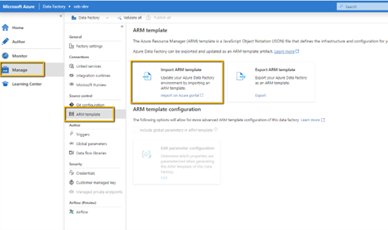

2.  Select "Build your own template in the editor."

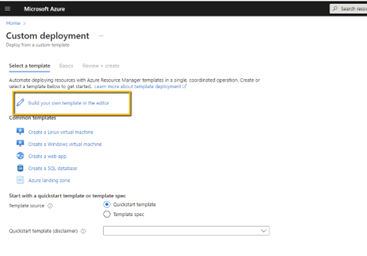

3.  Browse to "ARMTemplateForFactory.json" file.

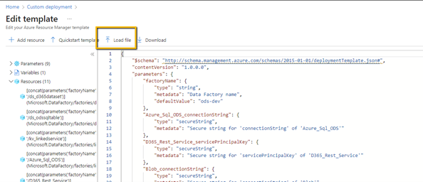

4.  Click Save

5.  Enter the configuration details.

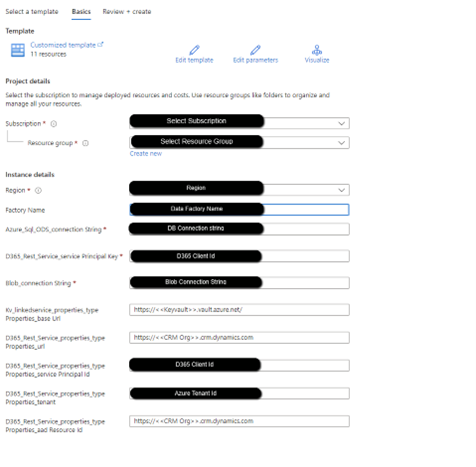

6.  Click Review + Create.

This will deploy the pipeline to the Data factory.

### Post deployment validation

1.  Open Data Factory Studio

2.  Navigate to Manage -> Linked Services and Test all the connections.

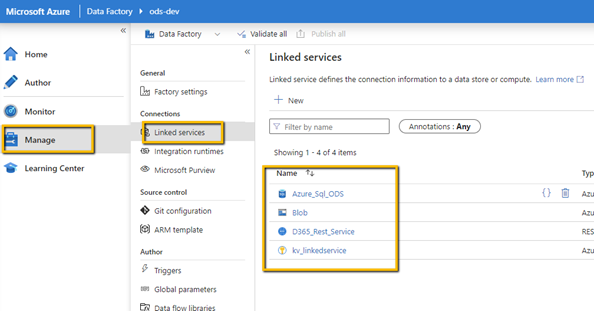

3.  Test all the connections.

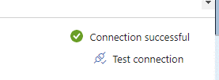

## Pipeline Details and Execution Sequence:

### 01 - Master Data Load

This is used to onboard all the D365 entities in SQL database. This
pipeline will create a new record for each D365 entity in
\[ODS\].\[EntitySync\] table.

The table \[ODS\].\[EntitySync\] has three important columns below

1. "SyncReady": The Data load will happen only for the Entities which
   has SyncReady = 1. This flag is used in the pipeline "03 - Data Sync
   Master"

How to set the SyncReady to 1.

```sql
UPDATE ODS.EntitySync
SET SyncReady = 1
WHERE EntityName = 'account'
```

2.  "SyncFrequency": This column is used in the pipeline "03 - Data Sync
    Master" for filtering purpose.

3.  DeltaToken: When this value is NULL, it means the entity is loaded
    for the first time and if it has value then the Data load will be
    performed based on the Delta Token. So any time if you wanted to
    perform full data load for the entity, then set the value as NULL
    for entity in the table.

How to set the DeltaToken to NULL.

```sql
UPDATE ODS.EntitySync
SET DeltaToken = NULL
WHERE EntityName = 'account'
```

**[Note:]**

- Execute this pipeline manually once you complete the setup of the
  pipelines.

- After first time execution, Any time when you have a brand new
  entity in D365 and if you wanted to perform Data Sync for the entity
  then execute this pipeline.

**PARAMETERS**: This pipeline has no parameters.

#### How to Execute the Pipeline

1.  Navigate to Author -\> 01 Master Data Load -\> Add Trigger -\>
    Trigger Now

2.  The pipeline will load data on ODS.EntitySync table.

3.  Update SyncReady Flag in ODS.EntitySync table using the below sample
    script. Update this flag for only the entities for which you wanted
    to sync the data from Dataverse.

```sql
UPDATE ODS.EntitySync
SET SyncReady = 1
where EntityName = 'account'
```

**Note:** Only the entities flagged as SyncReady = 1 will be set for data sync.

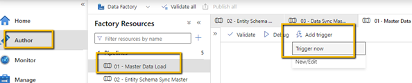

## 02 - Entity Schema Sync Master

This pipeline creates the actual physical table in the database for the
entities that are marked as SyncReady = 1 in the table
\[ODS\].\[EntitySync\] and inserts entity attribute details into
\[ODS\].\[EntityAttributeSchema\] table. There will be two tables
created for each entity, one with the ODS and other with STAGING schema.
Execute this pipeline manually after each solution deployment to
environment. This pipeline helps to sync the schema between D365 and the
SQL database.

**Note**

- Execute this pipeline manually once you complete the execution of
  the pipeline "01 - Master Data Load" setup of the pipelines.

- Execute this pipeline manually after each solution deployment to
  environment to have the entity schema be in sync between D365 and
  SQL Database. Basically if you are making any schema changes in the
  existing entity or adding any new entity in D365 and if you want
  those schema changes/new entity to get reflected in the Database
  then you should execute this pipeline.

**PARAMETERS**:

| Parameter  | Data Type | Default Value    | How to Use                                                                                                                                                                                                                                                                                 |
| ---------- | --------- | ---------------- | ------------------------------------------------------------------------------------------------------------------------------------------------------------------------------------------------------------------------------------------------------------------------------------------ |
| EntityName | String    | `{"key": "all"}` | If you want to run the pipeline for a specific entity, replace the word all with the table name in the comma separated format. For example: {“key” : “account, contact”}. If set to “all” it will pick up all entities for which SyncReady = 1 is set in the table \[ODS\].\[EntitySync\]. |

Navigate to 02 -- Entity Schema Sync Master -\> Add Trigger -\>
Trigger Now and mention the parameter value.

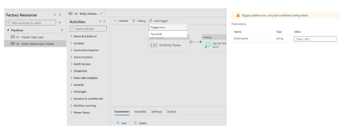

## 03 - Data Sync Master:

This pipeline will sync the data from D365 to Azure SQL db. It is
recommended to create triggers to sync the data at periodic intervals.
This way your data will be synced at regular intervals.

You can also run this pipeline only for selected entities by passing the
entity name as parameter.

**PARAMETERS**:

| Parameter     | Data Type | Default Value    | How to Use                                                                                                                                                                                                                                                   |
| ------------- | --------- | ---------------- | ------------------------------------------------------------------------------------------------------------------------------------------------------------------------------------------------------------------------------------------------------------ |
| SyncFrequency | String    | Daily            | Corresponds to the value in the SyncFrequency column in the ODS.EntitySync table. This must match any entity that you want to sync with this pipeline.                                                                                                       |
| EntityName    | String    | `{"key": "all"}` | Specifies the entity to sync. If you want to run the pipeline for a specific entity, replace the word all with the table name. For example: {“key”: “account, contact”} If set to “all” it will pick up all entities that match the SyncFrequency parameter. |

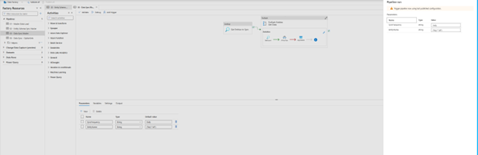

04 - Data Sync -- OptionSets

This pipeline creates the actual physical table in the database for
OptionSetMetadata and GlobalOptionSetMetadata and sync the data from
D365 to SQL to the respective tables.

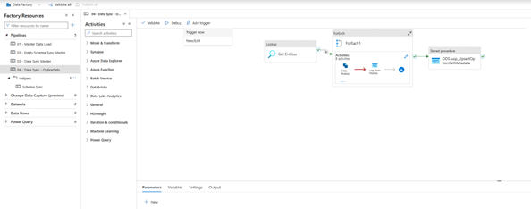

# Known Issues

There are no known bugs when using the framework at this point.
